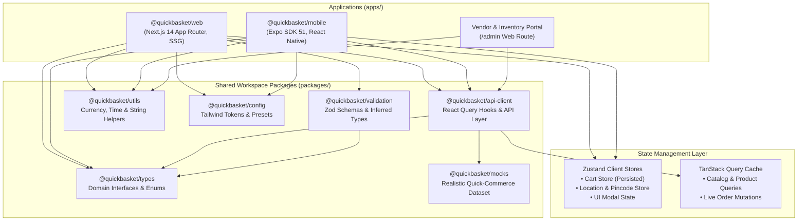

# ⚡ QuickBasket

> **Hyperlocal Quick-Commerce & Grocery Delivery Monorepo**  
> Delivering fresh groceries, dairy, vegetables, and everyday essentials to doorsteps in **under 15 minutes**. Powered by an omnichannel monorepo architecture for Web, Mobile, and Dark Store fulfillment.

---

[](https://turbo.build/)
[-000000?style=flat-square&logo=next.js&logoColor=white)](https://nextjs.org/)
[](https://reactnative.dev/)
[](https://expo.dev/)
[](https://www.typescriptlang.org/)
[](https://tailwindcss.com/)
[](https://tanstack.com/query)
[](https://zustand-demo.pmnd.rs/)
[](https://pnpm.io/)
[](https://pages.cloudflare.com/)

---

## 📖 Table of Contents

- [Overview](#-overview)
- [Monorepo Architecture](#-monorepo-architecture)
- [Applications & Packages](#-applications--packages)
- [Key Features](#-key-features)
- [Tech Stack](#-tech-stack)
- [Getting Started](#-getting-started)
- [Available Scripts](#-available-scripts)
- [Documentation Hub (`docs/`)](#-documentation-hub-docs)
- [Deployment](#-deployment)
- [License](#-license)

---

## 🌟 Overview

**QuickBasket** is an end-to-end quick-commerce solution modeled after high-speed delivery platforms (Zepto, Blinkit, Instamart). It provides:
- **Omnichannel Codebase**: Next.js 14 web app and Expo React Native mobile app sharing domain models, API queries, form validation, and design tokens.
- **Sub-15 Minute SLAs**: Dark store routing and pincode-level inventory verification.
- **Edge Static Export**: Web app exports to static assets (`output: 'export'`) with instant global edge delivery via Cloudflare Pages.
- **Multi-Vendor Ecosystem**: Support for hyper-local dark stores, neighborhood kirana shops, and organic farms.

---

## 🏛️ Monorepo Architecture



---

## 📦 Applications & Packages

```
QuickBasket/
├── apps/
│   ├── web/                    # Next.js 14 Web storefront & Admin portal
│   └── mobile/                 # React Native / Expo SDK 51 mobile app
├── packages/
│   ├── api-client/             # TanStack Query v5 hooks & mock API layer
│   ├── config/                 # Shared Tailwind preset, fonts & design tokens
│   ├── mocks/                  # Realistic Indian quick-commerce catalog & fixtures
│   ├── types/                  # Universal TypeScript domain models
│   ├── utils/                  # Currency (INR), ETA, slugify & discount math
│   └── validation/             # Zod validation schemas (Pincode, OTP, Checkout)
├── docs/                       # Comprehensive documentation folder
├── .github/workflows/          # Automated GitHub Actions CI pipeline
├── turbo.json                  # Turborepo task pipeline definition
├── pnpm-workspace.yaml         # pnpm workspace package globbing
└── tsconfig.base.json          # Root strict TypeScript configuration
```

### Detailed Workspace Packages

| Package | Workspace | Role / Description |
| :--- | :--- | :--- |
| **`@quickbasket/web`** | `apps/web` | Customer storefront and store manager `/admin` portal built on Next.js 14 App Router. |
| **`@quickbasket/mobile`** | `apps/mobile` | Cross-platform iOS & Android mobile application powered by Expo SDK 51 and NativeWind. |
| **`@quickbasket/api-client`** | `packages/api-client` | TanStack Query v5 query/mutation hooks providing reactive data caching and optimistic updates. |
| **`@quickbasket/types`** | `packages/types` | Domain TypeScript interfaces (`Vendor`, `Product`, `Variant`, `CartItem`, `Order`, `Address`). |
| **`@quickbasket/mocks`** | `packages/mocks` | In-memory dataset simulating 8 grocery verticals, realistic Indian brands, and live order tracking. |
| **`@quickbasket/validation`** | `packages/validation` | Zod validation schemas for 6-digit Indian pincodes, 10-digit mobile OTPs, and checkout forms. |
| **`@quickbasket/utils`** | `packages/utils` | Shared zero-dependency helpers: `formatCurrency` (INR), `formatEta`, `slugify`, `calculateDiscount`. |
| **`@quickbasket/config`** | `packages/config` | Shared Tailwind CSS preset featuring custom color tokens (`basil`, `leaf`, `mango`, `ink`). |

---

## ✨ Key Features

### 🛒 Customer Storefront (Web & Mobile)
- **10-15 Min Express Delivery**: Dynamic SLA countdowns and express-only product filtering.
- **Hyperlocal Location Selector**: Instant 6-digit pincode validation against serviceable dark store clusters.
- **Multi-Variant Product Cards**: Pack size selector (e.g. 500ml vs 1L, 1kg vs 5kg) with instant price and savings recalculation.
- **Persistent Shopping Cart**: Real-time item count badge, free delivery progress bar (threshold at ₹299), handling fee breakdown, and local storage persistence.
- **Seamless Express Checkout**: Saved address picker, delivery slot selector (Instant vs Scheduled), rider tipping, and mock UPI/Card/COD payments.
- **Live Order Timeline**: Real-time order progress milestones (`placed` → `packing` → `out_for_delivery` → `delivered`) with assigned rider details and vehicle registration numbers.

### 🛡️ Admin & Fulfillment Portal (`/admin`)
- **Fulfillment Telemetry**: Real-time tracking of average delivery speeds (`11.4 min` vs `15 min SLA`).
- **Partner Network Directory**: Overview of dark stores and local kirana partners across service zones.
- **Catalog Health**: SKU distribution tracking across all 8 grocery verticals.

---

## 💻 Tech Stack

| Layer | Technologies |
| :--- | :--- |
| **Monorepo Engine** | [Turborepo](https://turbo.build/) + [pnpm Workspaces](https://pnpm.io/workspaces) |
| **Web Framework** | [Next.js 14](https://nextjs.org/) (App Router, Static Export) |
| **Mobile Framework** | [React Native 0.74](https://reactnative.dev/) + [Expo SDK 51](https://expo.dev/) + [Expo Router](https://docs.expo.dev/router/introduction/) |
| **Styling & UI** | [Tailwind CSS v3.4](https://tailwindcss.com/) (Web) + [NativeWind v4](https://www.nativewind.dev/) (Mobile) |
| **State Management** | [Zustand](https://zustand-demo.pmnd.rs/) (Client State) + [TanStack Query v5](https://tanstack.com/query) (Server State) |
| **Forms & Validation**| [React Hook Form](https://react-hook-form.com/) + [Zod v3](https://zod.dev/) |
| **Icons & Typography**| [Lucide React](https://lucide.dev/), Clash Display, Satoshi & Space Grotesk |
| **Hosting & CI/CD** | [Cloudflare Pages](https://pages.cloudflare.com/) (Wrangler), [Expo EAS](https://expo.dev/eas), [GitHub Actions](https://github.com/features/actions) |

---

## 🚀 Getting Started

### Prerequisites
- **Node.js**: `v18.0.0` or higher (Recommended: `v20.x` LTS)
- **pnpm**: `v8.0.0` or higher (Workspace pinned to `v11.22.0`)
- **Git**

### 1. Clone & Install
```bash
# Clone the repository
git clone https://github.com/KISHOR403/QuickBasket.git
cd QuickBasket

# Install all workspace dependencies
pnpm install
```

### 2. Build Internal Packages
Build shared packages (`@quickbasket/types`, `@quickbasket/utils`, `@quickbasket/validation`, `@quickbasket/mocks`, `@quickbasket/api-client`):
```bash
pnpm build
```

### 3. Launch Development Servers

#### Launch Both Web & Mobile Concurrently:
```bash
pnpm dev
```

#### Launch Web Only (Next.js):
```bash
pnpm --filter @quickbasket/web dev
```
- Storefront: [http://localhost:3000](http://localhost:3000)
- Admin Portal: [http://localhost:3000/admin](http://localhost:3000/admin)

#### Launch Mobile Only (Expo):
```bash
pnpm --filter @quickbasket/mobile start
```
- Press `a` for Android Emulator.
- Press `i` for iOS Simulator.
- Press `w` for Mobile Web preview.
- Scan QR code with the **Expo Go** app on your physical mobile phone.

---

## 🛠️ Available Scripts

| Command | Action |
| :--- | :--- |
| `pnpm dev` | Starts all apps and packages in concurrent development mode. |
| `pnpm build` | Compiles shared packages and generates Next.js production static export (`apps/web/out/`). |
| `pnpm lint` | Runs ESLint across all apps and packages in the workspace. |
| `pnpm typecheck` | Executes TypeScript type checking (`tsc --noEmit`) across the entire repository. |
| `pnpm clean` | Cleans build artifacts, `.turbo/` cache, and `node_modules`. |
| `pnpm --filter @quickbasket/web dev` | Runs only the web application dev server. |
| `pnpm --filter @quickbasket/mobile start` | Runs only the mobile Expo development server. |

---

## 📚 Documentation Hub (`docs/`)

Explore in-depth documentation organized by domain:

- **[Documentation Index](docs/README.md)**: Central table of contents and navigation guide.
- **Architecture**:
  - [System Overview](docs/architecture/overview.md): High-level system design and end-to-end user journeys.
  - [Monorepo Pipeline](docs/architecture/monorepo-structure.md): Turborepo caching, dependencies, and pnpm workspaces.
  - [State Management](docs/architecture/state-management.md): Zustand client stores and TanStack Query cache policies.
- **Applications**:
  - [Web Storefront Guide](docs/apps/web.md): Next.js 14 App Router, routes, and static export.
  - [Mobile Application Guide](docs/apps/mobile.md): Expo SDK 51, Expo Router, and NativeWind.
  - [Admin Portal Guide](docs/apps/admin.md): Vendor directory and SLA performance dashboard.
- **Shared Packages**:
  - [API Client](docs/packages/api-client.md): Query hooks, mutations, and cache invalidation.
  - [Domain Types](docs/packages/types.md): TypeScript interfaces for products, orders, and vendors.
  - [Mock Data & Fixtures](docs/packages/mocks.md): Synthetic quick-commerce datasets and query helpers.
  - [Validation Schemas](docs/packages/validation.md): Zod schemas for addresses, pincodes, and checkout.
  - [Utility Functions](docs/packages/utils.md): Currency formatting (INR), ETA calculator, and slugifier.
  - [Design Tokens & Config](docs/packages/config.md): Shared Tailwind preset, color palette, and micro-animations.
- **Developer Guides**:
  - [Getting Started](docs/development/getting-started.md): Local environment setup, onboarding, and FAQs.
  - [Contributing Guidelines](docs/development/contributing.md): Conventional commits, branching, and PR checklist.
  - [Deployment Runbook](docs/development/deployment.md): Cloudflare Pages, Vercel, and Expo EAS builds.

---

## 🚢 Deployment

### Web (Cloudflare Pages)
The web client builds into a static bundle in `apps/web/out/`:
```bash
# Build production bundle
pnpm --filter @quickbasket/web build

# Deploy via Cloudflare Wrangler
cd apps/web
wrangler pages deploy out --project-name=quickbasket-web
```

### Mobile (Expo EAS)
```bash
cd apps/mobile
eas build --platform android --profile production
eas build --platform ios --profile production
```

---

## 📄 License

This project is licensed under the MIT License - see the LICENSE file for details.
