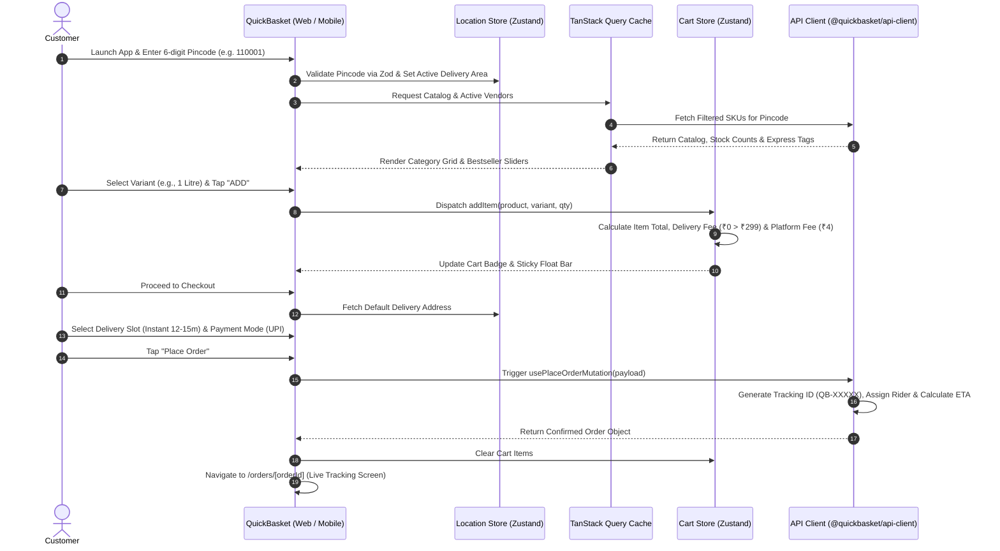

<div align="center">

# ⚡ QuickBasket

### Hyperlocal Quick-Commerce & Grocery Delivery Monorepo

**Delivering fresh groceries, dairy, farm produce, and daily essentials in under 15 minutes.**  
*An enterprise-grade omnichannel monorepo powered by Next.js 14, React Native (Expo), Turborepo, and TanStack Query.*

---

[](https://github.com/KISHOR403/QuickBasket/actions)
[](https://opensource.org/licenses/MIT)
[](https://nodejs.org/)
[](https://pnpm.io/)

[](https://turbo.build/)
[-000000?style=flat-square&logo=next.js&logoColor=white)](https://nextjs.org/)
[](https://reactnative.dev/)
[](https://expo.dev/)
[-3178C6?style=flat-square&logo=typescript&logoColor=white)](https://www.typescriptlang.org/)
[](https://tailwindcss.com/)
[](https://tanstack.com/query)
[](https://zustand-demo.pmnd.rs/)
[](https://zod.dev/)
[](https://pages.cloudflare.com/)

---

### [🚀 Quickstart](#-getting-started) • [📚 Documentation Hub](docs/README.md) • [🏛️ Architecture](#%EF%B8%8F-system-architecture) • [📦 Packages](#-workspace-packages-catalog) • [📱 Mobile App](docs/apps/mobile.md) • [🛡️ Admin Portal](docs/apps/admin.md) • [🤝 Contributing](docs/development/contributing.md)

</div>

---

## 📑 Table of Contents

- [Executive Summary](#-executive-summary)
- [Key Architectural Highlights](#-key-architectural-highlights)
- [System Architecture](#%EF%B8%8F-system-architecture)
- [Order Lifecycle Sequence](#-order-lifecycle-sequence)
- [Repository Topology](#-repository-topology)
- [Workspace Packages Catalog](#-workspace-packages-catalog)
- [Feature Matrix](#-feature-matrix)
- [Technology Stack](#-technology-stack)
- [Getting Started](#-getting-started)
- [Available Scripts](#-available-scripts)
- [Documentation Suite Index](#-documentation-suite-index)
- [Production Deployment](#-production-deployment)
- [Engineering Standards](#-engineering-standards)
- [License & Authors](#-license--authors)

---

## 🌟 Executive Summary

**QuickBasket** is an end-to-end, production-grade quick-commerce platform engineered for sub-15-minute fulfillment SLAs. Modeled after leading global quick-commerce architectures (Zepto, Blinkit, Instamart, Getir), QuickBasket solves key engineering challenges inherent to high-frequency on-demand delivery:

1. **Omnichannel Code Reusability**: Single TypeScript monorepo where the Next.js 14 Web Storefront and Expo React Native mobile apps share 100% of their business logic, domain models, validation contracts, query hooks, and design system tokens.
2. **Edge-First Static Export**: Next.js App Router configured for complete static site generation (`output: 'export'`), producing self-contained bundles distributed to Cloudflare Pages edge locations globally with sub-50ms TTFB.
3. **Decoupled State Boundaries**: Clear separation between persistent client state (cart, active address, UI modal state via Zustand) and reactive server state (catalog, vendor status, live orders via TanStack Query v5).
4. **Hybrid Fulfillment Ecosystem**: Unified data models supporting centralized Dark Stores (10-12 min express delivery), neighborhood Kirana stores, Organic Specialty Farms, and Regional Suppliers.

---

## ⚡ Key Architectural Highlights

| Feature | Description |
| :--- | :--- |
| **🚀 Sub-15 Min SLA Routing** | Pincode verification against dark store clusters with automated delivery time and fee calculations. |
| **🔄 Zero Code Duplication** | Shared internal packages (`@quickbasket/*`) linked via `workspace:*` protocols. |
| **📱 Cross-Platform Parity** | Shared styling tokens (Tailwind CSS on Web, NativeWind v4 on React Native/Expo). |
| **🛡️ End-to-End Type Safety** | Shared domain interfaces in `@quickbasket/types` enforced at runtime with `@quickbasket/validation` (Zod). |
| **💾 Offline-Resilient Cart** | LocalStorage-synced Zustand cart store with automated small-cart charges, delivery fees, and tips. |
| **⚡ Instant Turborepo Caching** | Cached builds with fingerprint hashing across all packages, delivering sub-second incremental builds. |

---

## 🏛️ System Architecture

```mermaid
graph TD
    subgraph Clients["Client Applications (apps/)"]
        Web["@quickbasket/web<br/>Next.js 14 App Router (SSG)<br/>Tailwind CSS + Lucide"]
        Mobile["@quickbasket/mobile<br/>Expo SDK 51 / React Native 0.74<br/>NativeWind v4"]
        Admin["Fulfillment Admin Portal<br/>Web Route (/admin)<br/>Dark Store Telemetry"]
    end

    subgraph StateLayer["State & Data Synchronization Layer"]
        ClientState["Client State (Zustand)<br/>• Cart Store (Persisted)<br/>• Location & Pincode Store<br/>• UI Modal Drawer State"]
        ServerState["Server Cache (TanStack Query v5)<br/>• Categories & Products<br/>• Dark Store Network<br/>• Live Order Tracking"]
    end

    subgraph SharedPackages["Shared Monorepo Libraries (packages/)"]
        ApiClient["@quickbasket/api-client<br/>React Query Hooks & API Layer"]
        Validation["@quickbasket/validation<br/>Zod Schemas (OTP, Address, Checkout)"]
        Types["@quickbasket/types<br/>Domain Interfaces & Enums"]
        Utils["@quickbasket/utils<br/>Currency (INR), ETA & Math Helpers"]
        Config["@quickbasket/config<br/>Shared Tailwind Preset & Tokens"]
        Mocks["@quickbasket/mocks<br/>Realistic Indian Quick-Commerce Dataset"]
    end

    subgraph Infrastructure["Infrastructure & Edge Deployment"]
        Cloudflare["Cloudflare Pages / Edge CDN<br/>Static Export (apps/web/out/)"]
        EAS["Expo Application Services (EAS)<br/>Android APK/AAB & iOS IPA"]
        GitHubActions["GitHub Actions CI<br/>Turborepo Remote Cache"]
    end

    %% Client App Dependencies
    Web --> ApiClient
    Web --> ClientState
    Web --> Config
    Web --> Types
    Web --> Utils
    Web --> Validation

    Mobile --> ApiClient
    Mobile --> ClientState
    Mobile --> Config
    Mobile --> Types
    Mobile --> Utils

    Admin --> ApiClient
    Admin --> Utils

    %% Data Layer Connections
    ApiClient --> Mocks
    ApiClient --> Types
    ApiClient --> ServerState
    Validation --> Types

    %% Infra Connections
    Web --> Cloudflare
    Mobile --> EAS
    Web & Mobile & SharedPackages --> GitHubActions
```



---

## 🔄 Order Lifecycle Sequence



---

## 📂 Repository Topology

```
QuickBasket/
├── apps/
│   ├── web/                            # Customer Storefront & Admin Portal (Next.js 14)
│   │   ├── app/                        # App Router routes ((storefront), (auth), admin)
│   │   ├── src/components/             # Modular React components (product, cart, layout)
│   │   ├── src/store/                  # Zustand client stores (cart.ts, location.ts, ui.ts)
│   │   ├── next.config.mjs             # Next.js static export & transpile config
│   │   ├── wrangler.toml               # Cloudflare Pages deployment configuration
│   │   └── package.json                # Web app dependencies & scripts
│   │
│   └── mobile/                         # Cross-Platform Mobile App (Expo SDK 51 / React Native)
│       ├── app/                        # Expo Router file-system routes ((tabs)/index, search, cart, account)
│       ├── app.json                    # Expo application metadata & deep linking
│       ├── babel.config.js             # Babel config with NativeWind v4 preset
│       └── package.json                # Mobile dependencies & start scripts
│
├── packages/                           # Shared Internal Workspace Packages
│   ├── api-client/                     # TanStack Query v5 hooks & asynchronous data layer
│   ├── config/                         # Tailwind CSS design system preset & color tokens
│   ├── mocks/                          # 70KB synthetic dataset (Indian brands, dark stores, seed orders)
│   ├── types/                          # Universal TypeScript domain models & interfaces
│   ├── utils/                          # Currency (INR), ETA calculator, slugifier & discount helpers
│   └── validation/                     # Zod input schemas (Pincode, OTP, Address, Checkout)
│
├── docs/                               # 16-File Modular Architecture & Operations Documentation
│   ├── architecture/                   # System design, Monorepo pipelines, State patterns
│   ├── apps/                           # Web, Mobile, and Admin specific manuals
│   ├── packages/                       # In-depth package API references
│   └── development/                    # Onboarding, Contributing, and Deployment guides
│
├── .github/workflows/ci.yml            # Automated GitHub Actions CI pipeline
├── turbo.json                          # Turborepo task dependencies (^build) & output caching
├── pnpm-workspace.yaml                 # pnpm workspace glob definitions
├── tsconfig.base.json                  # Root strict TypeScript compiler configuration
└── package.json                        # Root monorepo orchestrator scripts
```

---

## 📦 Workspace Packages Catalog

| Package | Directory | Tech Stack | Role & Responsibilities |
| :--- | :--- | :--- | :--- |
| **`@quickbasket/web`** | `apps/web` | Next.js 14, Tailwind, Lucide | Customer e-commerce storefront, static edge export, and `/admin` fulfillment operations dashboard. |
| **`@quickbasket/mobile`** | `apps/mobile` | Expo 51, RN 0.74, NativeWind | Native iOS and Android application with bottom-tab navigation and native layout performance. |
| **`@quickbasket/api-client`** | `packages/api-client` | TanStack Query v5, React | Type-safe React query and mutation hooks, cache invalidation, and mock network simulation. |
| **`@quickbasket/types`** | `packages/types` | TypeScript 5.4 | Single source of truth for all domain entities (`Vendor`, `Product`, `Variant`, `Order`, `Address`). |
| **`@quickbasket/mocks`** | `packages/mocks` | TypeScript 5.4 | Comprehensive in-memory seed catalog covering 8 grocery verticals, realistic Indian brands, and riders. |
| **`@quickbasket/validation`** | `packages/validation` | Zod v3.23 | Schema validation for 6-digit Indian postal codes, 10-digit phone OTPs, and express checkout forms. |
| **`@quickbasket/utils`** | `packages/utils` | TypeScript 5.4 | Zero-dependency utilities: Indian Rupee (`₹`) formatter, human ETA strings, slugifier, and discount math. |
| **`@quickbasket/config`** | `packages/config` | Tailwind CSS v3.4 | Shared design tokens, custom color palette (`basil`, `leaf`, `mango`, `ink`), typography, and animations. |

---

## ✨ Feature Matrix

### 🛒 Customer Storefront (Web & Mobile)
- **10-15 Min Express Engine**: Express delivery badges, SLA timers, and instant proximity filtering.
- **Hyperlocal Location Selector**: 6-digit Indian pincode validation with serviceable dark store clustering.
- **Multi-Variant Product Cards**: Real-time pack size switching (e.g. 500ml vs 1L, 1kg vs 5kg) with instant price and savings recalculation.
- **Smart Shopping Cart**: LocalStorage-persisted cart state with dynamic progress bar for free delivery (threshold at ₹299), small cart handling fees (₹4), and rider tips.
- **Express Checkout Flow**: Saved address selector, delivery slot scheduler (Instant vs Today), and multiple payment options (UPI, Credit/Debit Cards, Netbanking, COD).
- **Live Order Timeline**: Real-time order progress milestones (`placed` → `confirmed` → `packing` → `out_for_delivery` → `delivered`) with assigned rider details and vehicle registration numbers.

### 🛡️ Fulfillment & Admin Operations Portal (`/admin`)
- **Real-Time Fulfillment Telemetry**: Live tracking of dark store average delivery speed (`11.4 min` vs `15 min SLA`).
- **Partner Network Directory**: Live status of Dark Stores, Local Kiranas, and Organic Farms with active pincode routing.
- **Catalog & SKU Analytics**: Live inventory metrics across all 8 grocery verticals.

---

## 🛠️ Technology Stack

```
┌───────────────────┬────────────────────────────────────────────────────────┐
│ Dimension         │ Technologies                                           │
├───────────────────┼────────────────────────────────────────────────────────┤
│ Monorepo Engine   │ Turborepo v1.13+, pnpm Workspaces v11.22.0             │
│ Web Framework     │ Next.js 14.2 (App Router, Static Export SSG)          │
│ Mobile Framework  │ React Native 0.74, Expo SDK 51, Expo Router 3.5        │
│ Language          │ TypeScript 5.4 (Strict Type Checking)                  │
│ Styling           │ Tailwind CSS 3.4 (Web), NativeWind v4 (Mobile)         │
│ State Management  │ Zustand v4 (Client State), TanStack Query v5 (Server)   │
│ Form & Validation │ React Hook Form v7, Zod v3.23                          │
│ Icons & Fonts     │ Lucide React, Clash Display, Satoshi, Space Grotesk   │
│ CI / CD           │ GitHub Actions, Turborepo Remote Caching               │
│ Deployment        │ Cloudflare Pages (Wrangler), Expo EAS (iOS & Android)  │
└───────────────────┴────────────────────────────────────────────────────────┘
```

---

## 🚀 Getting Started

### System Prerequisites
Ensure your local environment meets the following specifications:
- **Node.js**: `v18.0.0` or higher (Recommended: `v20.x` LTS). Check: `node -v`
- **pnpm**: `v8.0.0` or higher (Monorepo pinned to `v11.22.0`). Check: `pnpm -v`
- **Git**: Latest version. Check: `git -v`

### 1. Clone the Repository
```bash
git clone https://github.com/KISHOR403/QuickBasket.git
cd QuickBasket
```

### 2. Install Dependencies
```bash
pnpm install
```

### 3. Build Shared Packages
Compile internal workspace libraries before launching application servers:
```bash
pnpm build
```

### 4. Launch Development Servers

#### Option A: Run Full Monorepo Concurrently
Starts both the Next.js web application and the Expo mobile bundler:
```bash
pnpm dev
```

#### Option B: Run Web Storefront Only
```bash
pnpm --filter @quickbasket/web dev
```
- **Storefront**: [http://localhost:3000](http://localhost:3000)
- **Admin Dashboard**: [http://localhost:3000/admin](http://localhost:3000/admin)

#### Option C: Run Mobile App Only (Expo)
```bash
pnpm --filter @quickbasket/mobile start
```
- Press `a` to open the active Android Emulator.
- Press `i` to open the iOS Simulator.
- Press `w` to open the mobile application in a web browser.
- Scan the printed QR code using the **Expo Go** mobile app.

---

## 📋 Available Scripts

The root `package.json` provides scripts orchestrated by Turborepo:

| Script | Command | Action |
| :--- | :--- | :--- |
| **`pnpm dev`** | `turbo run dev` | Runs all workspace applications in persistent dev mode concurrently. |
| **`pnpm build`** | `turbo run build` | Compiles shared packages and produces Next.js static production export (`apps/web/out/`). |
| **`pnpm lint`** | `turbo run lint` | Runs ESLint across all apps and shared packages. |
| **`pnpm typecheck`**| `turbo run typecheck` | Validates strict TypeScript compilation (`tsc --noEmit`) across the entire repository. |
| **`pnpm clean`** | `turbo run clean && rimraf node_modules` | Purges all build outputs, `.turbo/` cache, and workspace `node_modules`. |
| **`pnpm web`** | `pnpm --filter @quickbasket/web dev` | Convenience command to run only the web dev server on port 3000. |
| **`pnpm mobile`** | `pnpm --filter @quickbasket/mobile start`| Convenience command to launch only the mobile Expo server. |

---

## 📚 Documentation Suite Index

QuickBasket includes comprehensive, modular documentation in the [`docs/`](docs/README.md) directory:

| Section | Document | Summary |
| :--- | :--- | :--- |
| **Hub** | [Documentation Index](docs/README.md) | Central documentation directory and role-based navigation guides. |
| **Architecture** | [Architecture Overview](docs/architecture/overview.md) | High-level system design, sub-15 min SLA, and data flow. |
| | [Monorepo Pipeline](docs/architecture/monorepo-structure.md) | Turborepo task graph, caching rules, and pnpm workspaces. |
| | [State Management](docs/architecture/state-management.md) | Zustand client stores and TanStack Query caching architecture. |
| **Apps** | [Web Application](docs/apps/web.md) | Next.js 14 App Router, static export (`out/`), and layout systems. |
| | [Mobile Application](docs/apps/mobile.md) | Expo SDK 51, Expo Router tabs, and NativeWind styling guide. |
| | [Admin Portal](docs/apps/admin.md) | Dark store operations, SLA monitoring, and partner management. |
| **Packages** | [API Client](docs/packages/api-client.md) | React Query hooks, mutations, and cache invalidation patterns. |
| | [Domain Types](docs/packages/types.md) | TypeScript interfaces for vendors, products, carts, and orders. |
| | [Mock Datasets](docs/packages/mocks.md) | Synthetic grocery catalog, dark stores, and seed order fixtures. |
| | [Validation Schemas](docs/packages/validation.md) | Zod schemas for pincodes, phone OTP, and checkout inputs. |
| | [Utility Helpers](docs/packages/utils.md) | Currency (`₹`), ETA formatters, slugifier, and discount formulas. |
| | [Design System](docs/packages/config.md) | Shared Tailwind preset, custom palette, and keyframe animations. |
| **Guides** | [Getting Started](docs/development/getting-started.md) | Detailed developer onboarding guide and troubleshooting FAQ. |
| | [Contributing Guide](docs/development/contributing.md) | Branching strategy, Conventional Commits, and PR checklist. |
| | [Deployment Runbook](docs/development/deployment.md) | Production deployments for Cloudflare Pages and Expo EAS. |

---

## 🚢 Production Deployment

### 1. Web Application: Cloudflare Pages (Edge CDN)
The web client compiles to pure static HTML/JS/CSS assets inside `apps/web/out/`:
```bash
# Compile static export
pnpm --filter @quickbasket/web build

# Deploy via Cloudflare Wrangler
cd apps/web
wrangler pages deploy out --project-name=quickbasket-web
```

### 2. Mobile Application: Expo EAS (iOS & Android)
```bash
cd apps/mobile

# Build Android APK / App Bundle (AAB)
eas build --platform android --profile production

# Build iOS IPA (App Store)
eas build --platform ios --profile production
```

---

## 📏 Engineering Standards

- **TypeScript Strictness**: `"strict": true` enforced across all packages; zero untyped `any` allowances.
- **Commit Format**: [Conventional Commits](https://www.conventionalcommits.org/) required on all branches (`feat:`, `fix:`, `docs:`, `chore:`).
- **Automated CI**: GitHub Actions validates TypeScript typecheck and full monorepo build on every pull request.

---

## 📄 License & Authors

Distributed under the **MIT License**. See `LICENSE` for details.

Engineered with ❤️ for next-generation quick-commerce delivery.  
Repository: [https://github.com/KISHOR403/QuickBasket](https://github.com/KISHOR403/QuickBasket)
