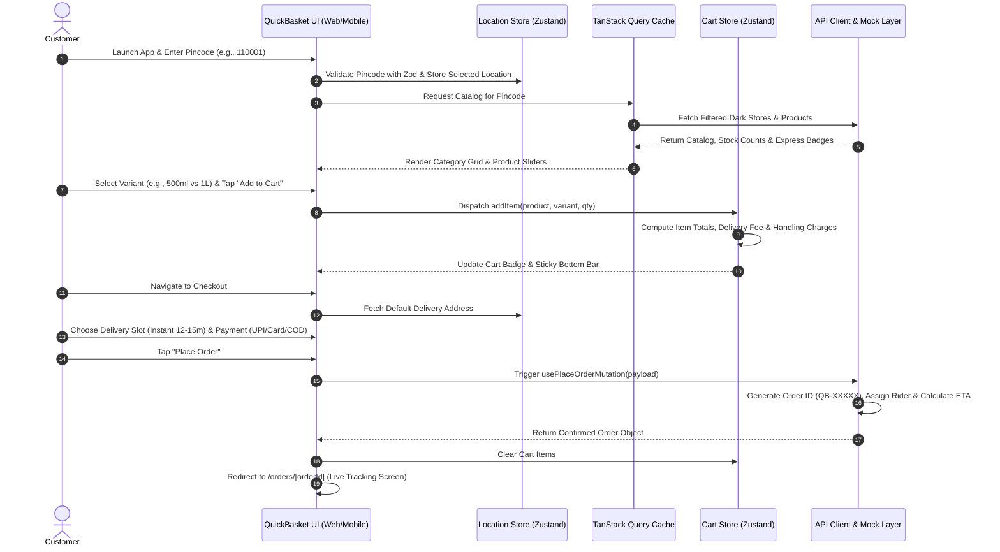

# 🏛️ Architecture Overview

QuickBasket is engineered as an enterprise-grade, omnichannel **hyperlocal quick-commerce** platform designed for sub-15-minute grocery deliveries. The architecture unifies both web storefront and native mobile clients within a high-performance Turborepo monorepo, sharing business logic, API clients, domain types, and design tokens.

---

## 🎯 Architectural Goals

1. **Sub-15 Minute SLA Architecture**: Optimized data models supporting dark store routing, hyperlocal pincode verification, and instant inventory visibility.
2. **Omnichannel Code Sharing**: Shared domain models (`@quickbasket/types`), queries/mutations (`@quickbasket/api-client`), and validation (`@quickbasket/validation`) between Next.js and Expo.
3. **Decoupled State Management**: Clean separation of persistent client state (cart, active address, UI modals) via Zustand from server-synchronized data caches via TanStack Query.
4. **Edge-First Static Export**: Next.js configured with `output: 'export'` ensuring zero-server-dependency HTML/CSS/JS bundles easily served via Cloudflare Pages or global CDNs.
5. **Multi-Vendor Ecosystem**: Support for diverse fulfillment node types: Dark Stores (express 10-min fulfillment), Local Kirana partners, Organic Farms, and Specialty Stores.

---

## 📐 System Architecture Diagram

```mermaid
graph TD
    subgraph ClientApplications["Client Applications (apps/)"]
        WebClient["@quickbasket/web<br/>(Next.js 14 App Router, SSG)"]
        MobileClient["@quickbasket/mobile<br/>(React Native 0.74, Expo 51)"]
        AdminPortal["Web Admin Portal<br/>(/admin Route in Next.js)"]
    end

    subgraph StateAndClientLayer["State & Client Layer"]
        ZustandClientState["Client State (Zustand)<br/>• Cart Store (persist)<br/>• Location Store<br/>• UI Modal Store"]
        ReactQueryServerState["Server Cache (TanStack Query v5)<br/>• Categories & Products<br/>• Vendor Network<br/>• Live Order Tracking"]
    end

    subgraph SharedPackages["Shared Monorepo Packages (packages/)"]
        ApiClient["@quickbasket/api-client<br/>React Query Hooks & API Layer"]
        ValidationPkg["@quickbasket/validation<br/>Zod Schemas & Types"]
        TypesPkg["@quickbasket/types<br/>Domain Interfaces & Enums"]
        UtilsPkg["@quickbasket/utils<br/>Currency, Time & Formatting"]
        ConfigPkg["@quickbasket/config<br/>Tailwind Tokens & Presets"]
        MocksPkg["@quickbasket/mocks<br/>Realistic Quick-Commerce Dataset"]
    end

    subgraph InfrastructureLayer["Infrastructure & Delivery"]
        CloudflarePages["Cloudflare Pages / Edge CDN<br/>Static Assets (out/)"]
        ExpoService["Expo Application Services (EAS)<br/>Android APK & iOS IPA"]
        GitHubActions["GitHub Actions CI<br/>Turborepo Remote Cache"]
    end

    %% Dependencies
    WebClient --> ApiClient
    WebClient --> ZustandClientState
    WebClient --> ConfigPkg
    WebClient --> UtilsPkg
    WebClient --> TypesPkg
    WebClient --> ValidationPkg

    MobileClient --> ApiClient
    MobileClient --> ZustandClientState
    MobileClient --> ConfigPkg
    MobileClient --> UtilsPkg
    MobileClient --> TypesPkg

    AdminPortal --> ApiClient
    AdminPortal --> UtilsPkg

    ApiClient --> MocksPkg
    ApiClient --> TypesPkg
    ApiClient --> ReactQueryServerState

    ValidationPkg --> TypesPkg

    WebClient --> CloudflarePages
    MobileClient --> ExpoService
    WebClient & MobileClient & SharedPackages --> GitHubActions
```

---

## 🔄 End-to-End User Journey Flow

---

## 🛡️ Core Design Principles

### 1. Zero Code Redundancy
Shared logic is kept in atomic packages (`@quickbasket/*`). Any modification to a product type, an address validation regex, or a currency formatting rule automatically propagates to both web and mobile applications at build and compile time.

### 2. High-Fidelity Mock Infrastructure
The mock data layer (`@quickbasket/mocks`) mimics an active quick-commerce enterprise with:
- Multi-variant SKUs (Milk 500ml/1L, Rice 1kg/5kg, Bread White/Brown).
- Realistic delivery zones across Tier 1 Indian metros (Delhi NCR, Bengaluru, Mumbai).
- Real-world fee structures (small cart fees, surge fees, free delivery thresholds above ₹299).
- Dynamic rider assignment and live order status lifecycles (`placed` → `packing` → `out_for_delivery` → `delivered`).

### 3. Rapid Edge Deployment
The web frontend is decoupled from server runtimes. By compiling into pure static assets, the site can be deployed across Cloudflare Pages edge locations globally with sub-50ms Time To First Byte (TTFB).
